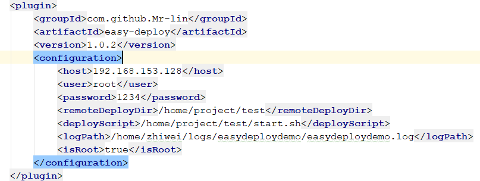

# easy deploy demo

## 说明
easy deploy插件部署例子（spring boot项目）

## 准备

在部署服务器上新建项目文件夹，然后将shell文件下的spring-boot.sh 拷贝过去，添加执行权限

比如在home下新建项目文件夹test，日志路径logs（该项目的日志路径在logback.xml 修改<property name="LOG_HOME" value="/home/zhiwei/logs" />）

修改pom中的部署配置参数



工程目录下命令执行

```shell
mvn clean package -Dmaven.test.skip=true com.github.Mr-lin:easy-deploy:1.0.2:java-deploy
```

或者手动打包后在maven插件中点击easy-deploy


